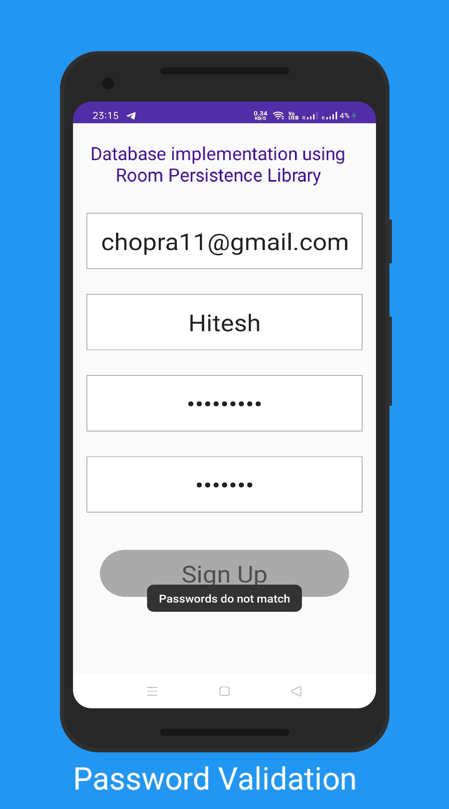
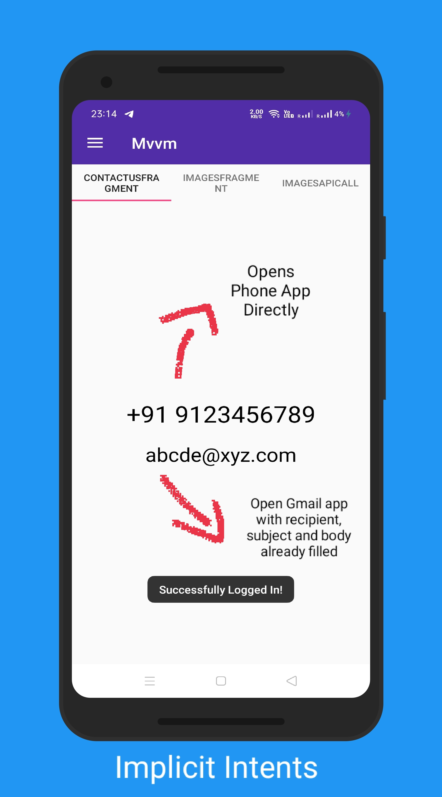
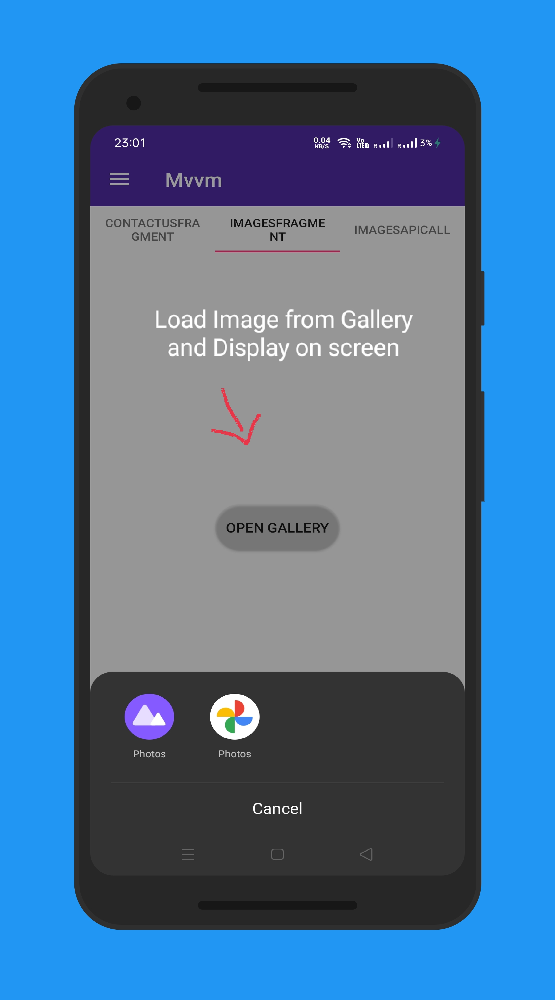
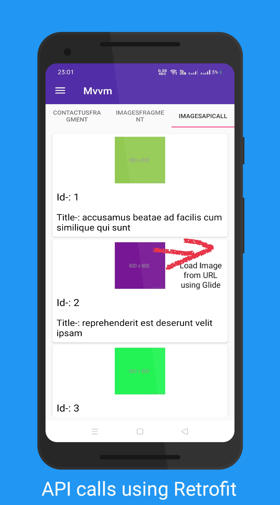
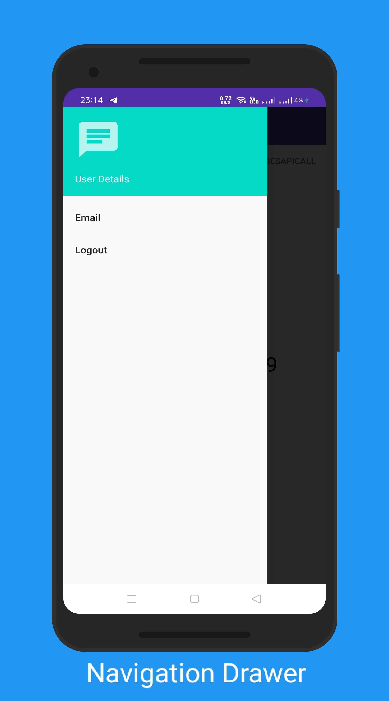

# Kotlin Login App

Kotlin login app is a login app based on MVVM archtecture written in Kotlin which uses Room Database for login and registration of users.Apart from this,it has a navigation drawer and viewpager with fragments.
It uses implicit intents to redirect to email app and phone dialer.Besides this,it also displays API data such as photos,id and title etc in RecycleViewer using Retrofit Library.

# Libraries used are
Retrofit,Glide,RecycleView,Room

# Link to the APK
https://github.com/hiteshchopra11/KotlinLoginApp/blob/master/app-release.apk

## Screenshots added-:
### Screenshot 1-:

### Screenshot 2-:

### Screenshot 3-:

### Screenshot 4-:

### Screenshot 5-:

